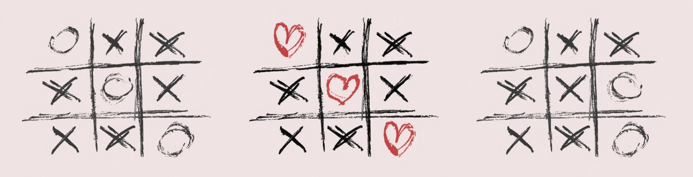

---

# 🎮 Console Tic-Tac-Toe

A modular, lightweight, and strictly object-oriented (OOP) command-line implementation of the classic Tic-Tac-Toe game, written natively in Python.

---

## 🛠️ Tech Stack & Prerequisites

*   **Language:** Python 3.8+ (No external dependencies required)
*   **Core Paradigms:** Object-Oriented Programming (OOP), Modular Architecture
*   **Standard Modules Used:** `random` (for turn randomization)
---

## ⚙️ Project Architecture & Design

The codebase strictly adheres to the Separation of Concerns (SoC) principle, isolating the game board logic from player profiles and runtime controllers.

```text
src/
│
├── main.py           # 🏁 Application Entry Point & Game Loop Controller
├── player.py         # 👤 Player Entity Model & State Data
└── tic_tac_toe.py    # 🧱 Board Matrix State & Rules Evaluator
```

### Component Details
- **`Player`** (`player.py`): Models a single competitor. It securely encapsulates mutable session variables, including the player's name, assigned symbol (`x` or `o`), and current move registry.

- **`TicTacToe`** (`tic_tac_toe.py`): Manages the underlying 1D list structure representing the 3x3 grid. It protects matrix states through internal validation rules and cross-checks moves against an immutable array of winning vectors.

- **`main.py`**: Houses the core execution context. It sanitizes terminal inputs, runs the primary turn loop, handles game state transitions (win/draw), and evaluates post-match replay conditions.

---

## 💎 Features

- **🛡️ Robust Input Sanitization**: Intercepts empty names, duplicate player names, out-of-bounds choices, and alphabet inputs inside coordinate lookups.

- **📊 Non-Destructive Hint Toggle**: Players can enter 'n' mid-game to safely view the available grid index coordinates without wiping or disrupting the active board state.

- **⚖️ Fair Turn Shuffling**: Utilizes a pseudo-random permutation algorithm to determine the starting player at the beginning of each session.

---

## 🚀 Installation & Execution

Follow these steps to clone the repository and run the game locally on your system:

### 1. Clone the Repository
Open your terminal and run the following command to download the project:

```bash
git clone https://github.com/Taha-26/Tic-Tac-Toe-Game.git
```

### 2. Navigate to the Project Directory
Move into the root directory of the cloned project:
```bash
cd Tic-Tac-Toe-Game
```


### 3. Run the Game
Execute the application entry point using Python:
```bash
python src/main.py
```